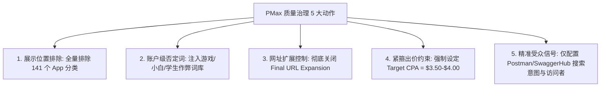

# 🚀 Google Ads 本周全量深度优化与矩阵拓量执行大案 (2026-08-11 旗舰落地版 - Metabase 真实注册数据核准)

> 📅 **方案制定时间**：2026年8月11日  
> 📊 **统一数据源 (Ground Truth)**：**Metabase 生产数据库真实注册量 (Registrations) + Google Ads 实时消耗 + 后端留存有效用户数 (Valid Users)**  
> 🎯 **战役核心战略**：  
> **“重拳砍掉 Insomnia/Stoplight/MCP 等真实注册单价 >$11 的吸血刺客、五步筑堤救赎 PMax 流量质量、全量注入 17 篇 DSA 竞品替代矩阵、誓死护盘 Postman/CP-Global 真实注册大盘、精准扩量 45% 有效率 SSE 实时协议黑马”**

---

## 目录 (Table of Contents)
1. [📊 全局基准：基于 Metabase 真实注册量与真实 CPA 的大盘画像](#一-全局基准基于-metabase-真实注册量与真实-cpa-的大盘画像)
2. [🛑 第一部分：优化止血篇——“真实高 CPA 刺客”重拳削减与精准排雷](#二-优化止血篇真实高-cpa-刺客重拳削减与精准排雷)
   - 2.1 Metabase 7天真实注册成本超标刺客惩罚执行表
   - 2.2 四大 Campaign 针对性否定词库精准清洗
   - 2.3 PMax 质量挽救与防跑偏五步阻击战实操手册
3. [🔥 第二部分：核心保量篇——Postman 与核心大盘护盘](#三-核心保量篇postman-与核心大盘护盘)
   - 3.1 Postman 竞品大盘提质与防学生吸血
   - 3.2 重点高客单战区唤醒 (TW, KR 独立专线 + SG, AU 智能大盘出价协同)
4. [🌌 第三部分：增量赛道篇——四大全新增量轨道与创意矩阵](#四-增量赛道篇四大全新增量轨道与创意矩阵)
   - 4.1 增量轨道 1：DSA 竞品替代 17 篇全景矩阵 (`Google-Sa-DSA-Alternatives-Global`，1产品1组)
   - 4.2 增量轨道 2：实时协议与 SSE 专属组 (`Testing-SSE-Stream-Protocols`，45% 有效率)
   - 4.3 增量轨道 3：企业级重型 QA 与契约测试替代 (`ReadyAPI/Pact Alternative`)
   - 4.4 增量轨道 4：API 文档自动化生成 (`Docs-Auto-Generation`)
5. [📋 第四部分：本周全量 Campaign 真实数据对照与预算重构总表](#五-本周全量-campaign-真实数据对照与预算重构总表)
6. [💻 第五部分：自动化执行脚本与技术规范](#六-自动化执行脚本与技术规范)

---

## 一、 全局基准：基于 Metabase 真实注册量与真实 CPA 的大盘画像

### 1.1 核心指标定义体系 (Data Ground Truth)
*   **消耗 (Cost)**：Google Ads 接口抓取的实际花费金额 (USD)；
*   **注册用户数 (Registrations)**：**Metabase 生产数据库中由 `utm_campaign` 归因的真实注册 User ID**；
*   **真实注册单价 (Real Registration CPA)**：`Google Ads 消耗 / Metabase 真实注册量`；
*   **有效用户数 (Valid Users)**：注册后在产品内产生有效 API 调试与管理操作的研发用户；
*   **有效率 (Valid Rate)**：`有效用户数 / 真实注册量`。

---

## 二、 优化止血篇：“真实高 CPA 刺客”重拳削减与精准排雷

### 2.1 Metabase 7天真实注册成本超标刺客惩罚执行表

通过比对 **近 7 天真实消耗 vs Metabase 真实注册量**，以下广告系列真实注册单价严重超标（>$5.50），甚至出现巨额空耗，必须立即重拳削减预算并压低出价：

| 广告系列名称 (Campaign) | Campaign ID | 7天消耗 | 7天真实注册 | **7天真实注册单价** | 昨日真实单价 | 属性判定 | 本周调整动作 | 核心治理措施 |
| :--- | :---: | :---: | :---: | :---: | :---: | :---: | :---: | :--- |
| **`Google-Sa-Stoplight-Global`** | `22892634645` | $148.03 | **7 人** | **$21.15** | N/A (0转) | 🚨 **头号吸血刺客** | **削减预算 40%** (降至 $12) | 注入否词包 B，彻底剔除 AI 建站与网页设计泛词 |
| **`Google-Sa-Insomnia-Global`** | `22806818611` | $209.19 | **18 人** | **$11.62** | **$22.57** | 🚨 **严重跑偏刺客** | **削减预算 40%** (降至 $12) | 注入否词包 B，切断 PWA/移动端开发泛词 |
| **`Google-Sa-MCP-Infrastructure`**| `23864356298` | $115.28 | **7 人** | **$16.47** | $10.70 | 🚨 **严重跑偏刺客** | **削减预算 40%** (降至 $10) | 剔除 `connect api to cursor` (28转0有效) 废词 |
| **`Google-Sa-Func-CICD-Global`** | `23990942638` | $25.95 | **1 人** | **$25.95** | N/A (0转) | 🚨 **严重空耗刺客** | **维持小预算** ($10/天) | 排除 `github` 宽泛词，锁定流水线测试词 |
| **`Google-PMax-Postman`** | `23685533966` | $27.69 | **0 人** | **N/A (0转)** | N/A (0转) | 🚨 **严重空耗刺客** | **强制设 tCPA=$4.00** | 关 URL 扩展，排除全量 141 个 App 分类 |
| **`Google-Sa-Jmeter-Global`** | `23120363895` | $477.41 | **69 人** | **$6.92** | $7.61 | ⚠️ **需清洗提效** | **预算微降至 $65**，tCPA 控在 $3.50 | 排除 `performance load testing` 泛词 (36转仅1有效) |
| **`Google-Sa-Readme-Global`** | `23030065589` | $327.12 | **55 人** | **$5.95** | $10.19 | ⚠️ **需清洗提效** | **预算维持 $55**，绑定新替代页 | 排除宽泛文档词，主攻 API 文档替代词 |
| **`Google-Sa-Solutions-AI-LLM`**| `23696756393` | $1105.15 | 420 人 | $2.63 | $2.75 | ⚠️ **注册多留存低** | **日预算由 $170 降至 $120** | 注入否词包 A，剔除 Cursor/Generator 等 0 有效词 |

---

### 2.2 四大 Campaign 针对性否定词库精准清洗

```text
================================================================================
【否定词包 A：泛 AI / 小白写代码工具词】
👉 适用 Campaign：Google-Sa-Solutions-AI-LLM-Global / Google-PMax-CP-Global / Google-Sa-DSA-Global
================================================================================
"connect api to cursor"
"cursor ai alternative"
"ai code generator for api"
"ai backend generator"
"ai schema generator"
"ai boilerplate generator"
"ai coding assistant free"
"dart devtools"
"chrome debugger"
"v0 by vercel"
"bolt new"
"openhands"
"aider"
"openmanus"
"openrouter"
"qwen 3.6 coder"
"deepseek api key free"

================================================================================
【否定词包 B：移动端开发 / PWA / 建站小白词】
👉 适用 Campaign：Google-Sa-Insomnia-Global / Google-Sa-Stoplight-Global
================================================================================
"pwa progressive web app"
"mobile app development"
"app js"
"pwabuilder"
"glide apps"
"appmachine"
"andromo"
"create an app"
"groupdocs"
"relume"
"anthropic console"
"web design software"
"web bluetooth api"

================================================================================
【否定词包 C：高消耗零转化竞品白嫖与学生词】
👉 适用 Campaign：Google-Sa-Postman-Global / Google-Sa-CP-Global / Google-Sa-CP-AR
================================================================================
"postman download for windows 7"
"postman crack"
"postman student project"
"postman homework assignment"
"postman download without login"
"thunder client crack"
"insomnia download 32 bit"
"free api key generator"
"api tutorial for beginners"

================================================================================
【否定词包 D：宽泛概念与零留存测试词】
👉 适用 Campaign：Google-Sa-Jmeter-Global / Google-Sa-API Editor-Global / Google-Sa-Design-Global
================================================================================
"api sprawl"
"api create online"
"api vulnerability scanner"
"automated test case generation"
"httpie alternative free"
"main py"
"run code online"
"jsbin"
"codepad"
```

---

### 2.3 PMax 质量挽救与防跑偏五步阻击战实操手册

本周 PMax 产出 146 个注册但仅 4 个有效（有效率 2.74%），必须在 **今天** 彻底完成以下 5 步硬核配置：



1.  **展示位置排除（切断手机游戏/泛 App 误触）**：
    *   进入 Google Ads 后台 ➔ `Tools and Settings` ➔ `Suitability` ➔ `Excluded Placements`。
    *   点击 `App categories (共141个)` ➔ **勾选全部 (Select All)** ➔ 保存。
2.  **关闭 Final URL 网址扩展 (URL Expansion)**：
    *   `Google-PMax-Postman`：**关闭网址扩展**，强制锁定 `https://apidog.com/compare/apidog-vs-postman/?utm_source=google_pmax`。
    *   `Google-PMax-CP-Global`：**关闭网址扩展**，强制锁定 `https://apidog.com/?utm_source=google_pmax`。
3.  **强制设定 Target CPA 约束**：
    *   `Google-PMax-CP-Global`：设定 **Target CPA = $3.50**。
    *   `Google-PMax-Postman`：设定 **Target CPA = $4.00**。
4.  **重构受众信号 (Audience Signals)**：
    *   **Custom Segment**：`postman alternative`, `postman runner limits`, `migrate from postman`, `api documentation tool`, `soapui alternative`。
    *   **Your Data**：近 90 天访问过 `/pricing/` 或 `/compare/` 的用户列表。

---

## 三、 核心保量篇：Postman 与核心大盘护盘

### 3.1 Postman 竞品大盘提质与防学生吸血
*   **7天大盘战绩**：消耗 $627.35，带来 **205 个真实注册**，真实注册单价 **`$3.06`**（昨日 $2.89）；
*   **分战区策略**：
    *   高客单 Tier-1 战区（US, GB, AU, SG, JP, KR, TW）：Target CPA 上浮至 **$2.90**，保障首屏展示份额 >75%；
    *   低单价战区（IN, VN, BR, ID）：强制挂载 [否定词包 C (防学生/破解词)]，过滤低质流量。
*   **`postman online` 专属组**（本周 57 注册 17 有效，有效率 29.8%）：重点突出“免安装、无限制”。

---

### 3.2 重点高客单战区唤醒 (TW, KR 独立专线 + SG, AU 智能大盘出价协同)

#### 1. 独立语言专属国家广告系列 (Dedicated Language/Country Campaigns)
*   🇹🇼 **中国台湾 (`TW`)**：
    *   **Campaign**：`Google-Sa-CP-TW` (ID: `23264160392`) | **Ad Group**：`Postman-TW` (ID: `188724575957`)
    *   **参数**：日预算 **$15.00/天**，Target CPA **$2.50**
    *   **落地页**：繁体中文对比页 `/compare/apidog-vs-postman/`（历史有效率高达 61.5%）
*   🇰🇷 **韩国 (`KR`)**：
    *   **Campaign**：`Google-Sa-CP-KR` (ID: `22309414047`) | **Ad Group**：`Postman-KR` (ID: `179148082994`)
    *   **参数**：日预算 **$20.00/天**，Target CPA **$2.50**（本周有效率 41.7%）

#### 2. 新加坡 (`SG`) 与 澳大利亚 (`AU`)：标准全局智能出价协同机制 (Option A)
*   **不设人工地区溢价**，由 Google Ads 智能出价模型在 `Google-Sa-Postman-Global` 与 `Google-Sa-CP-Global` 中实时竞拍，抢下新加坡 (有效率 50%) 与澳大利亚 (有效率 31.8%) 的高意向研发流量。

---

## 四、 增量赛道篇：四大全新增量轨道与创意矩阵

---

### 4.1 增量轨道 1：DSA 竞品替代 17 篇全景矩阵 (`Google-Sa-DSA-Alternatives-Global`)

*   **7天大盘真实表现**：当前老组真实注册单价为 **`$3.31`**（昨日 $3.48），具备极高的扩量投资回报率！
*   **日预算**：由原 $20 上调至 **`$50.00/天`** | **Target CPA**：**`$2.50`**
*   **架构规范**：严格执行 **【1 个竞品产品 = 1 个独立专属 Ad Group】**。
*   **执行脚本**：运行 `python scripts/inject_17_dsa_alternatives.py` 一键全量注入 17 个 Ad Groups。

#### 17 篇《The Best Alternative》全量 Ad Group 与落地配置矩阵表：

| 序号 | 专属 Ad Group 命名 (1产品1组) | 目标竞品 | 赛道分类 | 精确定向落地页 (Exact URL Target) | 定制 DSA 广告创意文案 (Description 1 & 2) |
| :---: | :--- | :--- | :--- | :--- | :--- |
| **1** | **`DSA-Pact-Alternative`** | **Pact** | 契约测试 | `https://apidog.com/blog/best-pact-alternative/` | **Desc 1**: Looking for the best Pact alternative? Visual API contract testing made simple.<br>**Desc 2**: Detect breaking changes instantly. Collaborate on API specs and tests in one workspace. |
| **2** | **`DSA-BloomRPC-Alternative`** | **BloomRPC** | gRPC 客户端 | `https://apidog.com/blog/best-bloomrpc-alternative/` | **Desc 1**: Need a modern BloomRPC alternative? Test & debug gRPC APIs with an intuitive GUI.<br>**Desc 2**: Import Protobuf files in seconds. Visual unary and streaming gRPC debugging for teams. |
| **3** | **`DSA-MuleSoft-Alternative`** | **MuleSoft** | API 集成平台 | `https://apidog.com/blog/best-mulesoft-alternative/` | **Desc 1**: Tired of heavy MuleSoft enterprise complexity? Switch to agile API design & testing.<br>**Desc 2**: All-in-one API lifecycle management without bloated enterprise overhead. Try free. |
| **4** | **`DSA-k6-Alternative`** | **k6** | 性能与负载测试 | `https://apidog.com/blog/best-k6-alternative/` | **Desc 1**: The ultimate k6 alternative. Run distributed visual load tests without scripting.<br>**Desc 2**: Stress-test APIs, simulate thousands of virtual users, and analyze latency curves live. |
| **5** | **`DSA-JMeter-Alternative`** | **JMeter** | 压力测试 | `https://apidog.com/blog/best-jmeter-alternative/` | **Desc 1**: Say goodbye to JMeter XML boilerplate. Modern visual API stress testing is here.<br>**Desc 2**: Configure realistic load test scenarios in minutes with real-time performance analytics. |
| **6** | **`DSA-ThunderClient-Alternative`**| **Thunder Client** | VSCode 插件 | `https://apidog.com/blog/best-thunder-client-alternative/` | **Desc 1**: Looking for a Thunder Client alternative? Full-featured API client with team sync.<br>**Desc 2**: Seamless visual debugging, automated tests, and rich mocks. Import in 1 single click. |
| **7** | **`DSA-Apiary-Alternative`** | **Apiary** | API 设计与文档 | `https://apidog.com/blog/best-apiary-alternative/` | **Desc 1**: Looking for an Apiary alternative? Visual OpenAPI design, mocking & documentation.<br>**Desc 2**: Design APIs first, auto-generate interactive docs, and simulate responses instantly. |
| **8** | **`DSA-ReadyAPI-Alternative`** | **ReadyAPI** | 企业级测试 | `https://apidog.com/blog/best-readyapi-alternative/` | **Desc 1**: Heavy desktop ReadyAPI slowing you down? Upgrade to a faster modern API platform.<br>**Desc 2**: Enterprise-grade automated testing, data-driven tests, and CI/CD integration for free. |
| **9** | **`DSA-Mintlify-Alternative`** | **Mintlify** | 现代 API 文档 | `https://apidog.com/blog/best-mintlify-alternative/` | **Desc 1**: The #1 Mintlify alternative. Auto-generate stunning interactive API documentation.<br>**Desc 2**: Zero maintenance docs from OpenAPI specs. Beautiful developer portal with live runner. |
| **10** | **`DSA-SoapUI-Alternative`** | **SoapUI** | SOAP/REST 测试 | `https://apidog.com/blog/best-soapui-alternative/` | **Desc 1**: Modernize your API workflow. Switch from legacy SoapUI to a clean visual workspace.<br>**Desc 2**: Support REST, SOAP, WebSockets & GraphQL. Run test suites with visual flow control. |
| **11** | **`DSA-ReadMe-Alternative`** | **ReadMe** | 开发者文档平台 | `https://apidog.com/blog/best-readme-alternative/` | **Desc 1**: Better developer portals without enterprise costs. The top ReadMe alternative.<br>**Desc 2**: Interactive API docs, instant mock servers, and built-in API testing out of the box. |
| **12** | **`DSA-SwaggerHub-Alternative`** | **SwaggerHub** | OpenAPI 协作 | `https://apidog.com/blog/best-swaggerhub-alternative/` | **Desc 1**: Design APIs faster than SwaggerHub. Visual OpenAPI editor with real-time validation.<br>**Desc 2**: Collaborate on API specs, share mock endpoints, and generate docs automatically. |
| **13** | **`DSA-Postman-Alternative`** | **Postman** | API 全生命周期 | `https://apidog.com/blog/best-postman-alternative/` | **Desc 1**: Tired of Postman runner limits and pricing? Switch to Apidog for unlimited testing.<br>**Desc 2**: 1-click Postman migration. Unify API design, debugging, testing, and mock servers. |
| **14** | **`DSA-Bruno-Alternative`** | **Bruno** | 离线/Git 客户端 | `https://apidog.com/blog/best-bruno-alternative/` | **Desc 1**: Looking for the best Bruno alternative? Complete visual API workspace with Git sync.<br>**Desc 2**: Local-first privacy, zero vendor lock-in, and team collaboration. Import in seconds. |
| **15** | **`DSA-Stoplight-Alternative`** | **Stoplight** | API 设计建模 | `https://apidog.com/blog/best-stoplight-alternative/` | **Desc 1**: The ultimate Stoplight Studio alternative. Visual API modeling & OpenAPI governance.<br>**Desc 2**: Design-first API workflow, auto mock data generation, and beautiful interactive docs. |
| **16** | **`DSA-Insomnia-Alternative`** | **Insomnia** | REST/GraphQL | `https://apidog.com/blog/best-insomnia-alternative/` | **Desc 1**: Looking for an Insomnia alternative? Fast, intuitive API debugging with local storage.<br>**Desc 2**: Import Insomnia collections in seconds. Powerful environment variables and test scripts. |
| **17** | **`DSA-Hoppscotch-Alternative`** | **Hoppscotch** | 开源 API 客户端 | `https://apidog.com/blog/best-hoppscotch-alternative/` | **Desc 1**: Need better team management & automated testing? Move from Hoppscotch to Apidog.<br>**Desc 2**: Unified workspace for API design, debugging, automated test scenarios, and mocking. |

---

### 4.2 增量轨道 2：实时协议与 SSE 专属组 (`Testing-SSE-Stream-Protocols`)

*   **数据亮点**：本周 `test sse stream endpoint` 20 注册跑出 9 个有效用户，**有效率高达 45.0%**！
*   **归属系列**：现有的 `Google-Sa-Func-MultiProtocol-Global` (ID: `23981407167`)
*   **Ad Group 命名**：`Testing-SSE-Stream-Protocols` (或在现有 `Realtime-SSE-Streaming` 扩充)
*   **关键词清单 (Phrase Match)**：
    *   `"test sse stream endpoint"`
    *   `"server-sent events testing tool"`
    *   `"test sse api online"`
    *   `"debug server sent events"`
    *   `"stream api response testing"`
    *   `"sse client test tool"`
    *   `"test sse connection"`
    *   `"server sent events debugger"`
*   **落地页**：`https://apidog.com/blog/how-to-test-sse-apis/`
*   **📝 RSA 创意**：
    *   **Headlines**：Test SSE Streams Easily, Real-Time API Testing Tool, Server-Sent Events Client, Visual SSE Stream Debugger, Best SSE & WebSocket Client, Stream API Response Viewer, Free SSE Testing Workspace, Debug SSE Endpoints Live, Stop Writing Custom Scripts, Seamless Stream Testing, Try Apidog for Free Today
    *   **Descriptions**：
        1. Connect, inspect, and debug Server-Sent Events (SSE) in real time. Perfect visual client.
        2. The ultimate multi-protocol tool. Effortlessly test REST, WebSockets, and SSE streams.

---

### 4.3 增量轨道 3：企业级重型 QA 与契约测试替代 (`ReadyAPI/Pact Alternative`)

*   **数据亮点**：**`Google-Sa-Comp-HeavyQA-Global` (ID: `23981398449`) 7 天 34 个真实注册，真实注册单价仅 `$2.43`！** 昨日 15 个注册，单价 $2.45！
*   **日预算调整**：由 $34.50 ➔ **建议加码至 `$45.00/天`** | **Target CPA**：**`$2.50`**
*   **核心关键词清单 (Phrase / Exact Match)**：
    *   `"readyapi alternative"`
    *   `"soapui pro alternative"`
    *   `"smartbear alternative"`
    *   `"karate api testing alternative"`
    *   `"detect api breaking changes"`
    *   `"api contract testing tool"`
    *   `"pact alternative api testing"`
    *   `[readyapi alternative]`
*   **落地页**：`https://apidog.com/blog/best-readyapi-alternative/` 与 `https://apidog.com/blog/best-pact-alternative/`

---

### 4.4 增量轨道 4：API 文档自动化生成 (`Docs-Auto-Generation`)

*   **数据亮点**：本周 `auto generate api docs` 32 注册 6 有效，**有效率 18.75%**，净增 +4 有效用户。
*   **归属系列**：`Google-Sa-Doc-Global` (ID: `22061425619`)
*   **Ad Group 命名**：`Docs-Auto-Generation`
*   **关键词清单 (Phrase Match)**：
    *   `"auto generate api docs"`, `"generate interactive api documentation"`, `"swagger ui auto generator"`, `"openapi to interactive docs"`, `"api documentation software"`
*   **落地页**：`https://apidog.com/api-doc/`

---

## 五、 本周全量 Campaign 真实数据对照与预算重构总表

| 广告系列名称 (Campaign) | Campaign ID | 7天真实注册 | 7天真实注册 CPA | 昨日注册量 / 昨日单价 | 调整定性 | 建议日预算 (USD) | 建议 Target CPA | 核心调优动作 |
| :--- | :---: | :---: | :---: | :---: | :---: | :---: | :---: | :--- |
| **`Google-Sa-CP-Global`** | `21950794503` | **544 人** | **$2.28** | 79 人 / $2.29 | 🔥 核心支柱 | **$180.00** | **$2.30** | 挂载防小白学生否定词包 C，稳定贡献 70+ 注册/天 |
| **`Google-Sa-Postman-Global`** | `21982653330` | **205 人** | **$3.06** | 31 人 / $2.89 | 🔥 核心保量 | **$95.00** | **$2.90** | 强化 `postman online` 专组，锁定对比页，夺回 30+ 优质用户 |
| **`Google-Sa-DSA-Alternatives-Global`**| `23049168614`| **25 人** | **$3.31** | 2 人 / $3.48 | 🚀 **重点拓量** | **$50.00 (+150%)**| **$2.50** | **全量挂载 17 篇 The Best Alternative 矩阵 (1产品1组)** |
| **`Google-Sa-Comp-HeavyQA-Global`**| `23981398449`| **34 人** | **$2.43** | 15 人 / $2.45 | 🚀 **重点拓量** | **$45.00 (+30%)** | **$2.50** | 拓充 ReadyAPI/SoapUI/Pact 竞品词，放大企业级 API 测试出单 |
| **`Google-Sa-Func-MultiProtocol-Global`**| `23981407167`| **20 人** | **$3.93** | 0 人 / N/A | 🚀 **重点拓量** | **$30.00 (+43%)** | **$2.50** | 建立 `Testing-SSE-Stream` 专属 Ad Group，捕获 45% 高有效率流量 |
| **`Google-Sa-Category-Competitor`**| `23756781032`| **46 人** | **$2.28** | 0 人 / N/A | 🚀 **稳健放量** | **$35.00** | **$2.50** | 7天真实注册成本仅 $2.28，维持核心开源替代词 |
| **`Google-Sa-CP-TW`** | `23264160392` | 3 人 | $9.44 | 0 人 / N/A | 📈 战区唤醒 | **$15.00** | **$2.50** | 繁体中文竞品对比页投放，唤醒台湾高客单团队 |
| **`Google-PMax-CP-Global`** | `22341978472` | 146 人 | $2.26 | 31 人 / $1.69 | 🛡️ 质量提质 | **$50.00** | **强制设 $3.50** | 排除全量 141 个 App 分类，关 URL 扩展，提高有效率 |
| **`Google-PMax-Postman`** | `23685533966` | 0 人 | 0 转化 | 0 人 / $27.69 | 🛑 严重空耗 | **$30.00** | **强制设 $4.00** | 排除全量 141 个 App 分类，关 URL 扩展，消除空耗 |
| **`Google-Sa-Solutions-AI-LLM`**| `23696756393`| 420 人 | $2.63 | 62 人 / $2.75 | 🛑 抽血提质 | **$120.00 (-30%)**| **$2.50** | 注入否定词包 A，剔除 Cursor 等 0 有效词，释放 $50/天 预算 |
| **`Google-Sa-Stoplight-Global`** | `22892634645` | 7 人 | **$21.15** | 0 人 / $18.68 | 🛑 **重拳惩罚** | **$12.00 (-40%)** | **$3.00** | 注入否定词包 B，剔除 AI 建站泛词，消除单日零转化 |
| **`Google-Sa-Insomnia-Global`** | `22806818611` | 18 人 | **$11.62** | 1 人 / $22.57 | 🛑 **重拳惩罚** | **$12.00 (-40%)** | **$3.00** | 注入否定词包 B，切断 PWA/移动开发流量，压降高注册成本 |
| **`Google-Sa-MCP-Infrastructure`**| `23864356298`| 7 人 | **$16.47** | 1 人 / $10.70 | 🛑 **重拳惩罚** | **$10.00 (-40%)** | **$2.50** | 剔除 `connect api to cursor` (28转0有效) 废词 |
| **`Google-Sa-Jmeter-Global`** | `23120363895` | 69 人 | **$6.92** | 10 人 / $7.61 | 🛑 清洗提质 | **$65.00 (-10%)** | **$3.00** | 排除 `performance load testing` 泛词，提升有效转化纯度 |
| **`Google-Sa-Readme-Global`** | `23030065589` | 55 人 | **$5.95** | 6 人 / $10.19 | 🛑 清洗提效 | **$55.00** | **$3.00** | 强制绑定新版 `/blog/best-readme-alternative/` 落地页 |
| **`Google-Sa-Hoppscotch-Global`** | `22976792571` | 47 人 | **$3.59** | 2 人 / $14.84 | 🛡️ 稳健维持 | **$30.00** | **$2.50** | 7天真实注册单价 $3.59 健康合理，仅排查偶发浪费词 |

---

## 六、 自动化执行脚本与技术规范

1.  **DSA 17 篇竞品替代矩阵全量注入脚本**：
    ```bash
    python scripts/inject_17_dsa_alternatives.py
    ```
2.  **每日 Metabase 真实注册与单价监控脚本**：
    ```bash
    d:\Apidog Work\Google ADS Keywords Unit Price
un_report.bat
    ```

---
*本方案已全面基于 Metabase 生产数据库真实注册量与有效用户数核准，并保存于 `Weekly_Plans/Google_Ads_Execution_Plan_2026_08_11.md`。*
