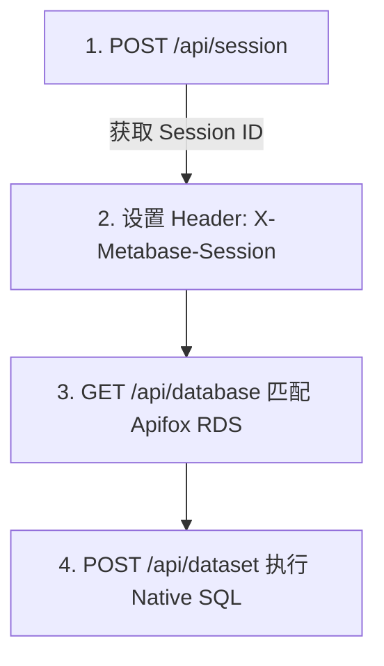

# 🔑 Metabase 登录与 Apifox RDS 数据查询指南

本文档记录了连接 Metabase API 提取 **Apifox RDS** 数据库中 **`user_trackings`**（注册用户追踪表）数据的完整逻辑与代码示例。

---

## 1. Metabase 基础信息与配置

* **Metabase 域名**: `https://metabase.apifox.cn/`
* **目标数据库**: `Apifox RDS` (或 `Apidog RDS`)
* **核心数据表**: `user_trackings`
* **网络代理（如适用）**: `http://127.0.0.1:7890`

---

## 2. API 交互与认证逻辑

Metabase 采用 Session 机制进行接口鉴权，完整提取数据分为以下 4 个步骤：



### 步骤详解：

1. **登录认证 (`POST /api/session`)**
   - **URL**: `https://metabase.apifox.cn/api/session`
   - **Body**: 
     ```json
     {
       "username": "<your_email>",
       "password": "<your_password>"
     }
     ```
   - **Response**: 返回 `id`，即 Session Token。

2. **设置请求头**
   - 后续所有 API 请求必须添加 Header：
     `X-Metabase-Session: <session_id>`

3. **获取数据库 ID (`GET /api/database`)**
   - 遍历数据库列表，匹配 `name` 为 `'Apifox RDS'` 或 `'Apidog RDS'`，提取对应的 `id`（例如 `db_id`）。

4. **执行 SQL 查询 (`POST /api/dataset`)**
   - **URL**: `https://metabase.apifox.cn/api/dataset`
   - **Payload**:
     ```json
     {
       "database": db_id,
       "type": "native",
       "native": {
         "query": "SELECT COUNT(*) FROM user_trackings WHERE created_at >= CURDATE();"
       },
       "parameters": []
     }
     ```

---

## 3. 核心 SQL 查询模版 (`user_trackings`)

### 模版 1：按渠道查询昨日注册量
```sql
SELECT
  `user_trackings`.`utm_source` AS `channel`,
  `user_trackings`.`utm_campaign` AS `campaign`,
  COUNT(*) AS `registration_count`
FROM
  `user_trackings`
WHERE
  `user_trackings`.`created_at` >= DATE(DATE_ADD(NOW(6), INTERVAL -1 day))
  AND `user_trackings`.`created_at` < DATE(NOW(6))
GROUP BY
  `user_trackings`.`utm_source`,
  `user_trackings`.`utm_campaign`
ORDER BY
  `registration_count` DESC;
```

### 模版 2：查询指定时间段内的 Apifox 总注册量
```sql
SELECT
  DATE(`created_at`) AS `date`,
  COUNT(*) AS `daily_registrations`
FROM
  `user_trackings`
WHERE
  `created_at` >= '2026-07-01' AND `created_at` < '2026-07-24'
GROUP BY
  DATE(`created_at`)
ORDER BY
  `date` ASC;
```

---

## 4. Python 自动化提取脚本示例

```python
import requests
import urllib3

urllib3.disable_warnings(urllib3.exceptions.InsecureRequestWarning)

METABASE_URL = "https://metabase.apifox.cn/"
METABASE_USERNAME = "bob@apifox.com"
METABASE_PASSWORD = "YOUR_PASSWORD"

PROXIES = {
    "http": "http://127.0.0.1:7890",
    "https": "http://127.0.0.1:7890"
}

def query_apifox_registrations(sql_query):
    # 1. 登录
    session_res = requests.post(
        f"{METABASE_URL}api/session",
        json={"username": METABASE_USERNAME, "password": METABASE_PASSWORD},
        proxies=PROXIES,
        verify=False
    )
    session_id = session_res.json().get("id")
    if not session_id:
        raise Exception(f"Metabase 登录失败: {session_res.text}")

    headers = {"X-Metabase-Session": session_id}

    # 2. 获取 Apifox RDS 数据库 ID
    db_res = requests.get(f"{METABASE_URL}api/database", headers=headers, proxies=PROXIES, verify=False)
    databases = db_res.json()
    if isinstance(databases, dict):
        databases = databases.get("data", [])

    db_id = None
    for db in databases:
        if db.get("name") in ["Apifox RDS", "Apidog RDS"]:
            db_id = db["id"]
            break
    
    if db_id is None and len(databases) > 0:
        db_id = databases[0]["id"]

    # 3. 执行查询
    query_payload = {
        "database": db_id,
        "type": "native",
        "native": {"query": sql_query},
        "parameters": []
    }
    
    res = requests.post(f"{METABASE_URL}api/dataset", json=query_payload, headers=headers, proxies=PROXIES, verify=False)
    data = res.json()
    
    # 4. 解析结果
    if "data" in data and "rows" in data["data"]:
        columns = [col["name"] for col in data["data"]["cols"]]
        rows = data["data"]["rows"]
        return [dict(zip(columns, row)) for row in rows]
    return []

if __name__ == "__main__":
    test_sql = "SELECT COUNT(*) as total FROM user_trackings WHERE created_at >= DATE(NOW());"
    results = query_apifox_registrations(test_sql)
    print("今日注册量结果:", results)
```

---
*文档更新于: 2026-07-23*
